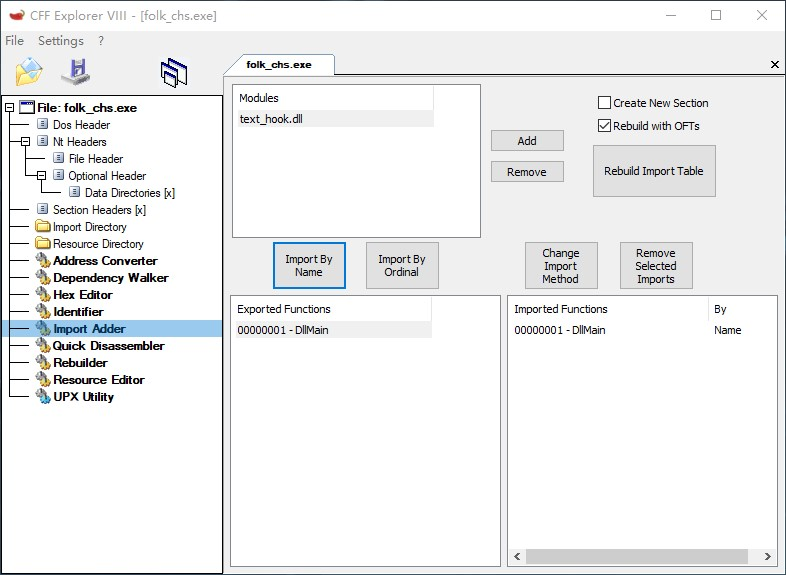

# TRANSLATE-TOOLS

[](https://github.com/renamed23/translate-tools/blob/main/LICENSE)
[](https://github.com/renamed23/translate-tools/actions/workflows/xtask-check.yml)


# 使用方式

`text-hook` 是用于游戏翻译的HOOK DLL，它包含很多功能，下面介绍如何使用它。

最简单的编译

32位DLL，编译的DLL在`target/i686-pc-windows-msvc/release/`

```powershell
cargo build-text-hook --features default_impl,enable_debug_output
```

64位DLL，编译的DLL在`target/x86_64-pc-windows-msvc/release/`

```powershell
cargo build-text-hook64 --features default_impl,enable_debug_output
```


编译出来的 `text-hook` 仅仅只是一个显示控制台窗口的空壳。通过添加`crates/text-hook/assets`的内容，以及在编译时添加对应的`features`，可以获得想要的功能。


> `crates/text-hook/assets`的完整介绍，请参考[docs/assets.md](docs/assets.md)
> 更多`features`请参考[crates/text-hook/Cargo.toml](crates/text-hook/Cargo.toml)

> 注意，`text-hook`重度依赖于编译期代码生成和运算，所以不太可能对不同游戏复用DLL二进制。如果需要修改某个配置，必须重新编译。


## DLL注入方式

DLL 必须注入到游戏的进程才可以发挥作用，`text-hook` 可以有两种注入方式
- 修改目标exe的导入表
- DLL劫持

当然也可以通过其他程序（比如一些启动器）或者DLL将 `text-hook` 注入游戏进程，但是这里只介绍非第三方注入的方式。

### 修改目标exe的导入表

- 当 `text-hook` 编译好之后，将它复制到游戏exe的目录（请确认游戏exe是32位还是64位）
- 假设游戏exe的名字叫 `folk.exe`，然后我们复制一份并改名为 `folk_chs.exe`。
- 运行 `CFF Explorer.exe`，并将刚复制的 `folk_chs.exe` 拖拽到 `CFF Explorer.exe`，在然后在左侧栏找到 `Import Adder`，然后点击右侧面板的 `Add` 按钮，找到 `text_hook.dll`并打开，会发现下面的 `Exported Functions` 会多出一个 `DllMain`，我们点击 `Import By Name`，然后点击 `Rebuild Import Table`，最后保存即可。



> 注意：修改导入表的方法并非万能，如果游戏exe有检查导入表的机制，那么可能会失败，无法运行，此时可以尝试使用DLL劫持的方法

根据上述步骤后，打开 `folk_chs.exe` 后，应该会弹出一个黑色的控制台，说明 `text-hook` 注入成功

### DLL 劫持


- 需要准备一个需要劫持的DLL，一般来说游戏都会使用winmm.dll，所以可以直接在系统目录复制要劫持的DLL到`crates/text-hook/assets/hijacked/winmm.dll`，请确认游戏是32位还是64位，如果是32位，那么复制`C:/Windows/SysWOW64/winmm.dll`，否则复制`C:/Windows/System32/winmm.dll`
- 编译的时候，`features`需要添加`enable_dll_hijacking`，如：
  ```powershell
  cargo build-text-hook --features default_impl,enable_debug_output,enable_dll_hijacking
  ```
- 将编译好的`text_hook.dll`改名为劫持的DLL的名字，这里就是`winmm.dll`，然后放到游戏目录即可

一般来说劫持系统DLL已经够用了，不过也可以尝试劫持游戏的DLL，但请确保它是纯C导出，步骤和上述一致，但是需要在`crates/text-hook/assets/config.json`中确保指定了`HIJACKED_DLL_PATH`字段的值，比如

```json
{
  "HIJACKED_DLL_PATH": "game_real.dll",
  // 其他配置
}
```


这里假设游戏的DLL名字叫`game.dll`，需要将编译好的text-hook改名为`game.dll`，然后将真实的`game.dll`改名为`game_real.dll`，这样游戏会加载 `text_hook`，然后 `text-hook` 会自动加载游戏真实的DLL，并转发导出函数。


## 使用常见功能

这类HOOK DLL最常见的功能是
- [日繁替换](#日繁替换)
- [修改字体](#修改字体)
- [覆盖主窗口标题](#覆盖主窗口标题)
- [注入字体](#注入字体)
- [转区运行](#转区运行)

通过 `--features default_impl,enable_debug_output` 编译出来的 `text-hook` 只是单纯的打印调试信息，不做任何事情。下面介绍如何添加这些功能。


### 日繁替换

在`crates/text-hook/assets`创建一个文件`mapping.json`

```json
{
  "code_page": 932,
  "mapping": {
    "鍄": "丽",
    "饋": "讶",
    "輸": "铛",
    "骼": "吵",
    "鎤": "秽",
    "鵡": "块",
  }
}
```

其中`code_page`指定了使用哪种代码页，一般来说固定为932即可，如果要做GBK的话，可以改为936，这样可以支持一些GBK不支持的字符显示。
`mapping`是一个`KEY` -> `VALUE`结构，其中`KEY`为替身字符，也就是会被映射的字符，`VALUE`是真实字符，一般来说，左侧就是CP932支持的字符，右侧是CP932不支持的字符。

然后我们编译的时候，需要添加`bind_text_mapping`这个feature，开启映射功能。

```powershell
cargo build-text-hook --features default_impl,bind_text_mapping
```

此时 `text-hook` 拥有了日繁替换的功能。

> 如果游戏显示有问题，可以尝试添加`assume_text_out_arg_c_is_byte_len`这个feature，对于一些老游戏很有用

### 修改字体

`text-hook` 提供了两种方式
- 固定字体，如果游戏没有选择字体的功能，请选择这种
- 非固定字体，如果游戏有选择字体的功能，请选择这种

#### 固定字体

在`crates/text-hook/assets`创建一个文件`config.json`

```json
{
  "FONT_FACE": "SimHei",
  "FONT_FILTER": ["Microsoft YaHei", "Microsoft YaHei UI"],
  // 其他配置
}
```

`FONT_FACE` 为固定的字体的名字，`SimHei`，`SimSun`等等。

`FONT_FILTER`为字体白名单，也就是说，如果传入的字体如果不匹配`FONT_FILTER`任意一个，则强制使用`FONT_FACE`的字体。该功能是为了防止完全固定所有字体，导致UI显示很难看。

然后我们编译的时候，需要添加`bind_font_manager`这个feature。

```powershell
cargo build-text-hook --features default_impl,bind_font_manager
```

#### 非固定字体

非固定字体的话，除了`bind_font_manager`，还需要添加`disable_forced_font`

```powershell
cargo build-text-hook --features default_impl,bind_font_manager,disable_forced_font
```

指定`disable_forced_font`后，`FONT_FILTER`会被解释为黑名单，而不是白名单，这样的话，就可以过滤掉不想要的日文字体了

```json
{
  "FONT_FACE": "SimHei",
  "FONT_FILTER": [
      "ＭＳ ゴシック",
      "俵俽 僑僔僢僋",
      "MS Gothic",
      "",
      "俵俽僑僔僢僋",
      "ＭＳゴシック",
  ],
  // 其他配置
}
```

### 覆盖主窗口标题

在`crates/text-hook/assets`创建一个文件`config.json`

```json
{
  "WINDOW_TITLE": "游戏窗口",
  // 其他配置
}
```

编译的时候，需要添加`bind_window_title_overrider`以及`enable_window_title_override`

```powershell
cargo build-text-hook --features default_impl,bind_window_title_overrider,enable_window_title_override
```

### 注入字体

将自定义字体放在 `crates/text-hook/assets/font` 文件夹下，编译时需要添加`enable_embedded_font`

```powershell
cargo build-text-hook --features default_impl,enable_embedded_font
```

注意，如果想要游戏使用这个字体，那么还需要固定字体，并且`FONT_FACE`设置为该字体的Font face，比如SE的`MSGothic_WenQuanYi_cnjp.ttf`，它的font face就是`MS Gothic`


### 转区运行

需要添加 `enable_locale_emulator`

```powershell
cargo build-text-hook --features default_impl,enable_locale_emulator
```

可以在`crates/text-hook/assets/config.json`中添加字段控制行为（可选）

```json
{
  "EMULATE_LOCALE_CODEPAGE": 932,
  "EMULATE_LOCALE_LOCALE": 1041,
  "EMULATE_LOCALE_CHARSET": 128,
  "EMULATE_LOCALE_TIMEZONE": "Tokyo Standard Time",
  "EMULATE_LOCALE_WAIT_FOR_EXIT": false,
  // 其他配置
}
```

注意别忘了将LE的`LoaderDll.dll`，`LocaleEmulator.dll`复制到`text-hook`所在位置。

# 减少 DLL 大小

`text-hook` 大量使用了编译期运算和代码生成，并根据`features`裁剪了不需要的代码。

可以更进一步，有多种方式可以将DLL裁剪到最小大小，一个具有日繁映射+修改字体+覆盖游戏主标题功能的DLL的通过如下的方法可以裁剪到25KB左右。


## 尝试使用 IAT HOOK

`text-hook` 默认使用 inline hook，该hook方式非常全面，但是也更重。IAT HOOK更快，也更轻，通过添加 `enable_iat_hook` 使用 IAT HOOK。

```powershell
cargo build-text-hook --features default_impl,enable_iat_hook
```

IAT HOOK 在大部分情况下都能有效工作，但是如果发现IAT HOOK不起作用，那么请删除这个 feature。


## 基于 `panic=immediate-abort` 编译

`immediate-abort`编译选项会剔除所有无关的错误信息，极大的减少DLL的体积，一般来说可直接使用。

将`RUSTFLAGS`环境变量设置为`-C panic=immediate-abort -Z unstable-options`，然后在编译命令中添加`-Z build-std`。

例如，假设使用的shell是`powershell`

```powershell
$env:RUSTFLAGS = "-C panic=immediate-abort -Z unstable-options"
cargo build-text-hook -Z build-std --fetures default_impl,enable_debug_output
```

# 写自己的HOOK实现

text-hook可以轻松针对不同的游戏写不同的HOOK实现（并且是0成本抽象，没有动态分发，全部都是编译期已知的函数），你只需要在`crates/text-hook/src/hook/impls`添加一个rs文件，假设有一个游戏叫做`crazy game`，那么我们添加一个`crazy_game.rs`

该文件必须包含`CrazyGameHook`（名称为文件名转 PascalCase 并加上 Hook 后缀）结构体

```rust
use translate_macros::DefaultHook;

#[derive(DefaultHook)]
pub struct CrazyGameHook;
```

然后我们需要在[crates/text-hook/Cargo.toml](crates/text-hook/Cargo.toml)中添加一个名为`crazy_game`（与文件名同名）的`feature`。

```toml
[features]
crazy_game = ["export_default_dll_main"]
```

然后我们就可以用自己的实现来编译text-hook

```powershell
cargo build-text-hook --features crazy_game
```

当然也可以和其他`feature`一起使用，就像`default_impl`一样


## 添加自定义行为

下面的代码展示了如何在Process Attach的时候，如何修改exe的代码，

```rust
use translate_macros::{DefaultHook, byte_slice};
use crate::utils::win32::HMODULE;
use crate::utils::exts::ptr_ext::PtrWriteExt;
use crate::hook::internal_hooks::ProcessAttach;

/// 定义 CrazyGameHook 结构体
/// 使用 DefaultHook 宏自动实现基础 Hook 逻辑
/// exclude(ProcessAttach) 表示我们要手动接管进程附加时的行为，不使用默认实现
#[derive(DefaultHook)]
#[exclude(ProcessAttach)]
pub struct CrazyGameHook;

impl ProcessAttach for CrazyGameHook {
    /// 当 DLL 被附加到进程（Process Attach）时触发的回调函数
    /// 
    /// 此函数的主要作用是：
    /// 1. 获取当前主程序的模块句柄。
    /// 2. 在特定的内存偏移处（0x2A78C）写入硬编码的汇编指令。
    fn on_process_attach(_hinst_dll: HMODULE) -> crate::Result<()> {
        // 获取当前进程主模块（.exe）的基地址
        // core::ptr::null() 表示获取当前可执行文件的句柄
        let handle = crate::utils::win32::get_module_handle(core::ptr::null())?;
        // 将句柄转换为字节指针，方便后续进行内存偏移计算
        let module = handle.cast::<u8>();

        unsafe {
            // 计算目标补丁地址：基地址 + 偏移量 0x2A78C
            // patch_asm 是一个自定义扩展方法，用于修改该地址的内存数据
            // 写入的字节码 "EB 14 90" 对应的汇编指令通常是：
            // EB 14 -> JMP SHORT +0x14 (短跳转，跳过随后的 20 字节代码)
            // 90    -> NOP (空指令，通常用于填充对齐)
            module.add(0x2A78C).patch_asm(&byte_slice!("EB 14 90"))?;
        }
        Ok(())
    }
}
```

这样，使用该impl编译的text-hook，会在附加到游戏进程的时候，自动修改exe的代码，就像x64dbg那样。

## 其他的实用例子

`crates/text-hook/src/hook/impls`有不少可供参考的例子
- 自定义HOOK函数: [complets.rs](crates/text-hook/src/hook/impls/complets.rs)
- HOOK游戏文本: [hitocos.rs](crates/text-hook/src/hook/impls/hitocos.rs)
- HOOK游戏内存: [old_minori.rs](crates/text-hook/src/hook/impls/old_minori.rs)
- 大规模修改exe代码以及内嵌文件: [natsu_natsu.rs](crates/text-hook/src/hook/impls/natsu_natsu.rs)

## 提示

如果你使用的是vscode，那么在`.vscode/settings.json`中的`rust-analyzer.cargo.features`添加feature才能让`rust-analyzer`正确工作。

```json
{
    "rust-analyzer.cargo.features": [
        // HOOK实现，只能选一个
        // "c4",
        // "complets",
        // "default_impl",
        // "g0win",
        // "hitocos",
        "hitocos2",

        "enable_resource_pack",
        "enable_dll_hijacking",
        "enable_embedded_font",
        "enable_collect_host_font_config",
        "bind_asset_virtualizer",
        // "bind_path_redirector",
        "bind_font_manager",
        "bind_lifecycle_guard",
        "bind_text_mapping",
        "bind_user_interface_patcher",
        "bind_window_title_overrider",
        "disable_forced_font",
        "assume_text_out_arg_c_is_byte_len",
        "enable_window_title_override",
        "enable_debug_output",
        "enable_text_mapping_debug",
        "auto_apply_1337_patch_on_hwbp_hit",
        "enable_overlay",
        "enable_iat_hook",
        "enable_custom_font",
        "enable_locale_emulator",
        "enable_patch",
        "enable_overlay_egui",
        "enable_egui_logger",
        "enable_egui_demo",
        "enable_egui_font_property_editor",
        "enable_storage"
    ],
}
```

一些过程宏需要资产文件才能正确生成代码，为了抑制错误，我们可以先使用`cargo xtask use-test-assets`来抑制错误。

```powershell
cargo xtask use-test-assets
```

然后重启一下`rust-analyzer`或者`rust-analyzer: Reload workspace`就好了。